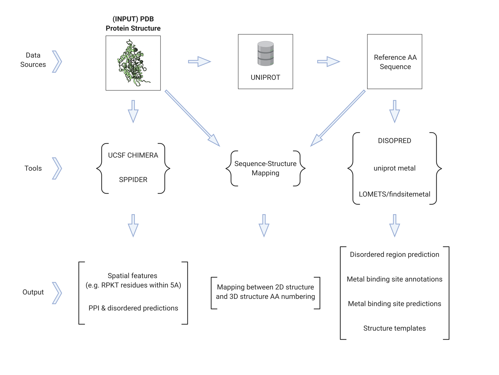

# Protein Features

## What is this?

This repository contains a collection of scripts and pipelines to help researchers extract a matrix of features describing a 3D protein structure.

We have used these tools on RPKT residues in E. coli, D. radiodurans, and human proteins to predict which amino acids are most vunerable to carbonylation, a form of oxidative damage that can lead to protein degredation. For more information, see [our preprint](https://www.biorxiv.org/content/10.1101/2020.03.09.983213v1.abstract).

## Status

This project is public and functional, but not yet well-documented for external use. If you're interested, check out the [documentation](https://julianstanley.github.io/ProteinFeatures/), send us an email, or post an issue and we can try to help.

Here is a copy of the UCSF Chimera version we used: [dropbox link](https://www.dropbox.com/s/emwkftqw6o7axiv/UCSF-Chimera64-2019-07-10.zip?dl=0)
## Authors

Created by the [Silver Lab](http://silver.med.harvard.edu/) at Harvard Medical School.

Contacts:

* Julian (Research Assistant, julian_stanley at hms dot harvard dot edu)

* Dr. Roger Chang (Project Lead, roger_chang at hms dot harvard dot edu)

## Project Overview

